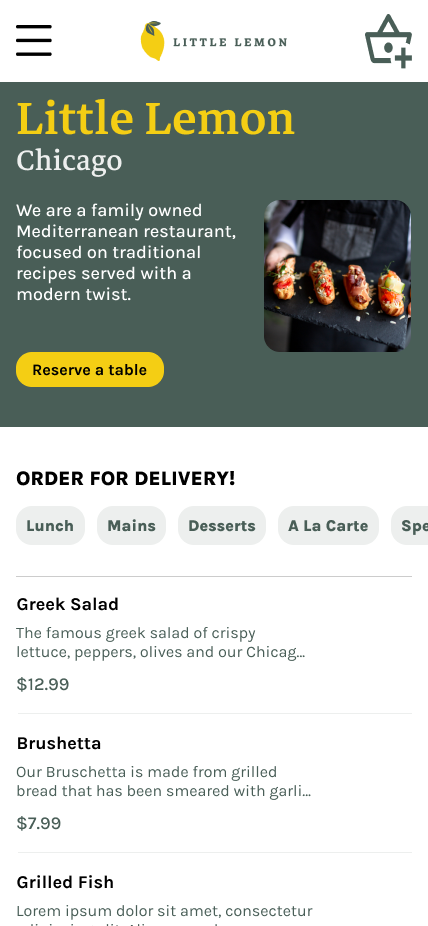
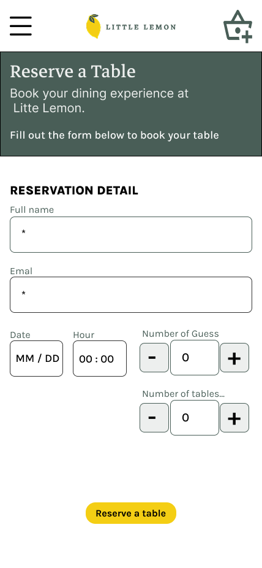
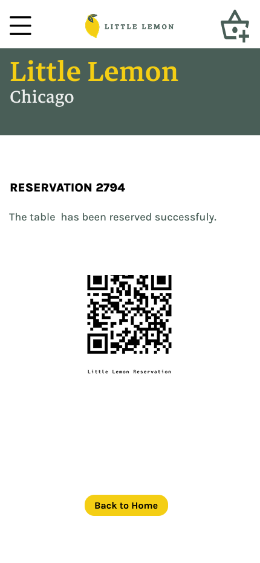

# little-lemon-ux
## Coursera Principles of UX and UI

### Overview

Design and prototype the reserve a table feature for the mobile version of the Little Lemon restaurant website. 
This task will include, designing information architecture, and incorporating text, animations and graphics of branding and content.

You are encouraged to follow the steps you learned throughout this UX UI course. Therefore, you will be expected to create a solution to the problem, a persona, a journey map, wireframes and an interactive high-fidelity prototype.

### Define and research

1. Little Lemon currently has no online reserve-a-table feature which is what you need to design.

2. Use research to create a persona and a journey map representing your target market. Think about who your users may be and why they would want to reserve a table online.

3. Create a [user persona.](https://www.figma.com/design/c3opoiUQY62GPdOS3wXIbM/Person?m=auto&t=4DM84OMtVxXH8KJH-6)

4. Create a [user journey map](https://www.figma.com/board/FpEzULoT4aphUn4B2pMHGD/mapLittleLemon?t=gqVZIlAMmd1Gj5oe-).

   

### Design and functionality

1. Create [low-fidelity wireframes](https://www.figma.com/proto/ATi3XOdIfH4tGYI3BXVGml/Little-Lemon-wire-frame?node-id=0-1&t=gqVZIlAMmd1Gj5oe-1) in Figma to define the features and functionality of the reserve-a-table element.
   
2. Create an interactive, [high-fidelity visual design Prototype](https://www.figma.com/proto/HUktLxzcR7G2vop2uDT7U1/little-lemon-proto?t=nN0t8U06PS8PD7Nc-1&scaling=min-zoom&content-scaling=fixed&page-id=0%3A1&node-id=1-36&starting-point-node-id=1%3A36) in Figma for the reserve-a-table feature of the Little Lemon website, considering all the best practice design principles learned within the course.
   
### Wire frames

### Prototype
* * * * *
Home page.
* * * * *

 

* * * * *
Reservation screen.
* * * * *
 
 

* * * * *
Confirmation screen.
* * * * *

 

 
